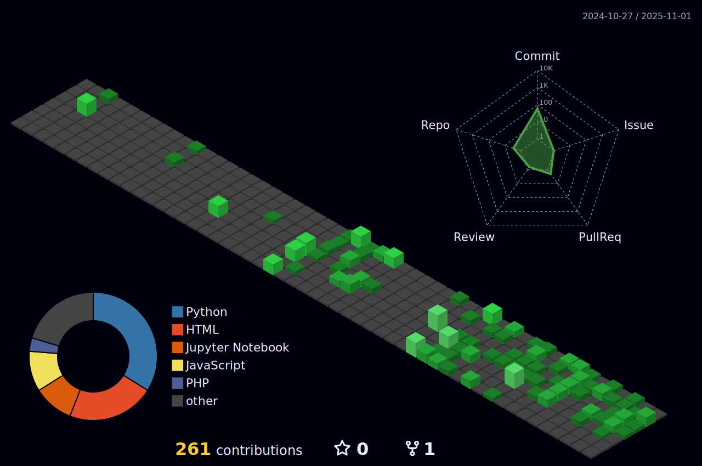

# 
Hi there! I'm Khan Mohammad Emon 👋

 
  

  
  
  

## 🎓 About Me

Computer Science and Engineering graduate from United International University. My undergraduate thesis focused on medical image analysis using deep learning models, which strengthened my understanding of Machine Learning and Digital Image Processing. My research interests include Machine Learning, Data Mining, and Deep Learning.

- 🔭 Working on enhancing my skills in full-stack development
- 🌱 Currently learning **React and FastAPI**
- 📚 Published researcher in the field of deep learning for medical imaging
- 💼 Experience as a Grader at United International University

## 🛠️ Technical Skills

  
  
  
  
  

  
  
  
  
  
  
  
  
  
  
  
  

## 📊 GitHub Stats

  
  

## 🏆 Experience

- **Grader** at United International University *(Nov 2022 – Jan 2024)*
  - CSE 3521: Database Management Systems
  - IPE 3401: Industrial and Operational Management
  - MATH 1151: Fundamental Calculus

- **Joint General Secretary** at UIU App Forum *(Aug 2022 – Mar 2023)*

## 📝 Publication

**[ENRRN-AU-Net: A Hybrid Deep Learning Model to Classify and Segment Histopathology Images of Breast Cancer](https://ieeexplore.ieee.org/abstract/document/10499623/)**  
*2024 International Conference on Advances in Computing, Communication, Electrical, and Smart Systems (iACCESS)*

